# Remediation Twin

Remediation Twin is an enterprise remediation operating system for turning chaotic security findings into prioritized, simulated, approved, campaign-managed, and auditable remediation work.

It ingests vulnerability, cloud, identity, infrastructure, application, and compliance findings; maps them to assets and ownership; scores business risk; simulates remediation impact before execution; generates rollout and rollback plans; routes approvals; tracks campaigns; and exports evidence.

## Why It Exists

Enterprises rarely lack detection tools. They have too many findings, too many tickets, unclear ownership, duplicate remediation requests, uncertain production impact, and scattered audit evidence.

Remediation Twin answers:

- What should we fix first?
- Which asset, service, owner, and business process is affected?
- What could break if we apply the remediation?
- Which approvals, exceptions, or freeze windows apply?
- What is the safest rollout and rollback plan?
- Can low-risk work be auto-approved under policy?
- How do we prove remediation happened and reduced risk?

## Implemented Capabilities

- Multi-tenant backend with tenant-scoped APIs
- JSON and CSV finding ingestion
- Mock ingestion for demonstrations
- Asset inventory and relationship mapping
- Finding deduplication and source finding correlation
- Risk and business-risk scoring
- Remediation action generation
- Simulation engine for multiple remediation types
- Rollout, validation, and rollback plan generation
- Workflow approvals
- Evidence capture and evidence readiness
- Jira, GitHub, ServiceNow, scanner, cloud, and Kubernetes connector run framework
- Connector onboarding readiness matrix
- Durable ingestion job operations
- Deterministic AI copilot contract
- SSO metadata configuration
- Advanced RBAC permission catalog
- Reporting snapshots
- CI/CD, Kubernetes, cloud, and IAM automation dry-run hooks
- Policy-governed automation and risk-based auto-approval
- Continuous simulation
- Predictive residual-risk modeling
- Self-updating remediation campaigns
- Campaign operating board
- Autonomous remediation control plane

## Main Screens

| Screen | Route | Purpose |
| --- | --- | --- |
| Dashboard | `/` | Executive remediation overview |
| Findings | `/findings` | Finding backlog and detail |
| Assets | `/assets` | Asset inventory |
| Asset Graph | `/asset-graph` | Asset dependencies, exposure, and risk transfer |
| Remediation Queue | `/remediation` | Generated remediation actions |
| Simulations | `/simulations` | Simulation history and impact contracts |
| Workflows | `/workflows` | Approval workflow |
| Evidence | `/evidence` | Evidence records and readiness |
| Integrations | `/integrations` | Integration registry |
| Connectors | `/connectors` | Connector onboarding readiness |
| Ingestion Jobs | `/ingestion-jobs` | Scanner/API ingestion job operations |
| Reports | `/reports` | Executive reporting |
| Automation | `/automation` | Execution hook dry runs |
| Policies | `/policies` | Governance policy builder |
| Exceptions | `/exceptions` | Risk exceptions and freeze windows |
| Campaigns | `/campaigns` | Self-updating remediation campaigns |
| Campaign Board | `/campaign-board` | Campaign operating board |
| Governance | `/governance` | Autonomous remediation governance |
| Control Plane | `/operating-system` | Closed-loop remediation operating system |
| Enterprise | `/enterprise` | SSO, RBAC, and connector readiness |
| Audit | `/audit` | Unified audit timeline |
| Settings | `/settings` | Tenant settings |

## API Summary

More detail is available in [docs/API.md](docs/API.md).

| Area | Endpoints |
| --- | --- |
| Health | `GET /api/health` |
| Tenants | `GET /api/tenants`, `POST /api/tenants` |
| Ingestion | `POST /api/ingest/json`, `POST /api/ingest/csv`, `POST /api/mock-ingest` |
| Dashboard | `GET /api/dashboard` |
| Assets | `GET /api/assets`, `POST /api/assets`, `GET /api/assets/:id` |
| Findings | `GET /api/findings`, `GET /api/findings/:id` |
| Remediation | `GET /api/remediation-actions`, `POST /api/remediation-actions/:id/simulate`, `POST /api/remediation-actions/:id/plan`, `POST /api/remediation-actions/:id/workflow` |
| Workflows | `GET /api/workflows`, comments, approvals, decisions, evidence |
| Integrations | `GET /api/integrations`, `POST /api/integrations`, `POST /api/connectors/run` |
| Pilot Readiness | `GET /api/pilot-readiness`, `POST /api/pilot-readiness` |
| Copilot | `POST /api/copilot` |
| Enterprise | `GET /api/sso`, `POST /api/sso`, `GET /api/rbac/evaluate`, `POST /api/rbac/evaluate` |
| Reporting | `GET /api/reports`, `POST /api/reports` |
| Automation | `GET /api/automation/hooks`, `POST /api/automation/hooks`, `GET /api/automation/run`, `POST /api/automation/run` |
| Maturity | `GET /api/asset-graph`, `GET /api/operating-system`, `POST /api/operating-system`, `GET /api/evidence/packs`, `GET /api/audit/timeline` |
| Governance | `GET /api/policies`, `POST /api/policies`, `POST /api/governance/continuous-simulation`, `GET /api/governance/predictive-risk`, `POST /api/governance/apply-fix`, `GET /api/campaigns`, `POST /api/campaigns` |

## Phase Coverage

| Phase | Goal | Implemented Surface |
| --- | --- | --- |
| Phase 0: Prototype | Prove concept with sample data and limited simulation | Mock ingestion, dashboard, asset mapping, risk scoring, simulation, plan generation |
| Phase 1: Production MVP | Support real enterprise pilot | Multi-tenant backend, CSV/API ingestion, ingestion jobs, remediation queue, approvals, connector framework, evidence export |
| Phase 2: Enterprise Readiness | Prepare for broader deployment | SSO, RBAC, connector onboarding, ServiceNow/scanner/cloud readiness, reporting, audit, scale-oriented indexes |
| Phase 3: Automation Expansion | Expand execution orchestration | CI/CD, Kubernetes, cloud, IAM dry-run hooks, risk-aware approval mode |
| Phase 4: Autonomous Governance | Enable trusted semi-autonomous remediation | Policy-governed fixes, continuous simulation, predictive risk, campaigns, control plane |

## Architecture

```mermaid
flowchart LR
  scanners["Scanners and enterprise tools"] --> ingest["Ingestion APIs and jobs"]
  ingest --> normalize["Normalization and deduplication"]
  normalize --> assets["Asset inventory and relationships"]
  assets --> risk["Risk scoring"]
  risk --> actions["Remediation actions"]
  actions --> simulations["Simulation engine"]
  simulations --> plans["Remediation plans"]
  plans --> workflow["Approval workflow"]
  workflow --> automation["Automation dry runs"]
  automation --> evidence["Evidence and reports"]
  evidence --> campaigns["Campaigns and governance"]
```



## Tech Stack

- Next.js App Router
- React
- TypeScript
- Prisma
- SQLite for local development
- Zod validation
- Vitest
- Lucide React icons

## Quick Start

```bash
npm install
cp .env.example .env
npm run db:push
npm run dev
```

Open:

```text
http://localhost:3000
```

For local builds that need the database URL:

```bash
DATABASE_URL="file:./dev.db" npm run build
```

## Demo Flow

1. Open the dashboard.
2. Click **Load prototype data**.
3. Review high-risk findings.
4. Open the remediation queue.
5. Run a simulation.
6. Generate a plan.
7. Open a workflow and review approvals.
8. Visit `/connectors` to register a pilot connector profile.
9. Visit `/ingestion-jobs` to run a scanner ingestion job.
10. Visit `/campaign-board` to review campaign readiness.
11. Visit `/operating-system` for closed-loop remediation coverage.

Prototype data can also be loaded with:

```bash
curl -X POST http://localhost:3000/api/mock-ingest
```

## Development Commands

```bash
npm run dev
npm run build
npm run start
npm run typecheck
npm test
npm run db:generate
npm run db:push
npm run db:studio
```

## Testing

```bash
npm test
npm run typecheck
DATABASE_URL="file:./dev.db" npm run build
```

## Production Notes

For production deployment, replace SQLite with a managed relational database, configure secret management for connector credentials, add background workers for long-running ingestion and simulation jobs, connect enterprise identity providers, and enforce environment-specific policy controls.

## Documentation

- [Product Requirements Document](PRD.md)
- [API Reference](docs/API.md)
- [Architecture Notes](docs/ARCHITECTURE.md)
- [Runbook](docs/RUNBOOK.md)

## License

This repository does not currently declare an open-source license. Add a license before distributing or accepting external contributions.
