# Remediation Simulation and Orchestration Platform

An enterprise remediation control plane for turning chaotic security findings into prioritized, simulated, approved, and auditable remediation work.

The platform ingests vulnerability, cloud, identity, infrastructure, application, and compliance findings; maps them to assets and ownership; scores business risk; simulates the operational impact of fixes before execution; generates remediation plans; routes approvals; exports evidence; and supports governed automation from prototype through semi-autonomous remediation.

## Why This Exists

Large enterprises rarely have a shortage of detection tools. They have the opposite problem: too many findings, too many tickets, unclear ownership, duplicate remediation requests, uncertain production impact, and scattered audit evidence.

This platform is designed to answer the questions existing scanners and ticketing systems usually do not answer together:

- What should we fix first?
- Which asset, service, owner, and business process is affected?
- What could break if we apply the remediation?
- Which approvals are required?
- What is the safest rollout and rollback plan?
- Can a low-risk fix be automatically approved under policy?
- How do we prove the remediation happened and reduced risk?

## Product Scope

This repository contains a full-stack Next.js application with a Prisma-backed data model and enterprise remediation domain logic. It is intentionally built as a working application rather than a static mockup.

### Implemented Capabilities

- Multi-tenant backend with tenant-scoped APIs
- JSON and CSV finding ingestion
- Prototype mock ingestion for demonstrations
- Asset inventory and asset relationship mapping
- Finding deduplication and source finding correlation
- Risk and business risk scoring
- Remediation action generation
- Simulation engine for multiple remediation types
- Rollout, validation, and rollback plan generation
- Remediation queue and workflow approvals
- Evidence capture and export records
- Jira, GitHub, ServiceNow, scanner, cloud, and Kubernetes connector run framework
- Deterministic AI copilot contract
- SSO service provider metadata configuration
- Advanced RBAC permission catalog
- Reporting snapshots
- CI/CD, Kubernetes, cloud, and IAM automation dry-run hooks
- Policy-governed automation and risk-based auto-approval
- Continuous simulation
- Predictive residual risk modeling
- Self-updating remediation campaigns
- Operational UI for dashboard, findings, assets, remediation, simulations, workflows, evidence, integrations, reports, automation, campaigns, governance, and enterprise readiness

### Enterprise Maturity Surfaces

| Surface | Route | Purpose |
| --- | --- | --- |
| Asset Graph | `/asset-graph` | Shows asset dependency edges, risk transfer, exposure, maturity scores, hotspots, and service concentration. |
| Autonomous Control Plane | `/operating-system` | Shows closed-loop remediation coverage, connector maturity, execution playbooks, governance state, and simulation learning. |
| Policy Builder | `/policies` | Displays enforced and advisory governance policies and can create a production change-board guardrail through the policy API. |
| Exceptions and Freeze Windows | `/exceptions` | Tracks risk exceptions, production change freezes, and approval routing as governed policies. |
| Evidence Pack Readiness | `/evidence` | Scores each workflow for simulation, plan, approval, evidence, and validation completeness. |
| Audit Timeline | `/audit` | Combines audit logs, connector runs, automation runs, and report snapshots into one control-plane history. |
| Rich Simulation Detail | `/simulations` | Surfaces approval requirements and rollout steps from simulation result contracts. |

The corresponding APIs are `/api/asset-graph`, `/api/operating-system`, `/api/policies`, `/api/evidence/packs`, and `/api/audit/timeline`, all backed by Prisma queries and application logic rather than static seed responses.

## Phase Roadmap Coverage

| Phase | Goal | Implemented Surface |
| --- | --- | --- |
| Phase 0: Prototype | Prove concept with sample data and limited simulation | Mock ingestion, findings dashboard, asset mapping, basic risk scoring, one-click simulation, plan generation |
| Phase 1: Production MVP | Support real enterprise pilot | Multi-tenant backend, CSV/API ingestion, inventory, remediation queue, simulation engine, approvals, Jira/GitHub connector framework, evidence export, copilot v1 |
| Phase 2: Enterprise Readiness | Prepare for broader enterprise deployment | SSO metadata, RBAC catalog, ServiceNow connector framework, scanner connector registry, reporting snapshots, audit records, scale-oriented indexes, expanded simulation types |
| Phase 3: Automation Expansion | Expand execution orchestration | CI/CD hooks, Kubernetes rollout automation plans, cloud remediation plans, IAM automation plans, risk-aware approval mode |
| Phase 4: Autonomous Remediation Governance | Enable trusted semi-autonomous remediation | Policy-governed fixes, continuous simulation, predictive risk modeling, self-updating campaigns, planning and verification contracts |

## Application Architecture

```mermaid
flowchart LR
  scanners["Scanners and enterprise tools"] --> ingest["Ingestion APIs"]
  ingest --> normalize["Normalization and deduplication"]
  normalize --> assets["Asset inventory and relationships"]
  assets --> risk["Risk scoring"]
  risk --> actions["Remediation actions"]
  actions --> simulations["Simulation engine"]
  simulations --> plans["Remediation plans"]
  plans --> workflow["Approval workflow"]
  workflow --> automation["Automation dry runs"]
  automation --> evidence["Evidence and reports"]
  evidence --> governance["Governance policies and campaigns"]
```



### Tech Stack

- **Frontend:** Next.js App Router, React, TypeScript
- **Backend:** Next.js API routes
- **Database ORM:** Prisma
- **Default database:** SQLite for local development
- **Validation:** Zod on ingestion routes
- **Testing:** Vitest
- **UI icons:** Lucide React

## Repository Structure

```text
.
├── prisma/
│   └── schema.prisma
├── src/
│   ├── app/
│   │   ├── api/
│   │   ├── automation/
│   │   ├── campaigns/
│   │   ├── enterprise/
│   │   ├── governance/
│   │   ├── reports/
│   │   └── ...
│   ├── components/
│   ├── domain/
│   └── lib/
├── docs/
│   ├── API.md
│   ├── ARCHITECTURE.md
│   └── RUNBOOK.md
├── Dockerfile
├── docker-compose.yml
├── package.json
└── PRD.md
```

## Quick Start

### 1. Install Dependencies

```bash
npm install
```

### 2. Configure Environment

```bash
cp .env.example .env
```

For local development, set:

```bash
DATABASE_URL="file:./dev.db"
DEFAULT_TENANT_SLUG="default"
```

### 3. Initialize Database

```bash
npm run db:push
```

### 4. Start Development Server

```bash
npm run dev
```

Open:

```text
http://localhost:3000
```

## First Demo Flow

The app starts empty by design. For a quick product demo:

1. Open the dashboard.
2. Click **Load prototype data**.
3. Review high-risk findings on the dashboard.
4. Open a finding and inspect its mapped asset context.
5. Go to **Remediation Queue**.
6. Run a simulation for a remediation action.
7. Generate a plan.
8. Open a workflow.
9. Review approvals and evidence.
10. Visit **Governance** to run continuous simulation and inspect predictive risk.

You can also seed prototype data through the API:

```bash
curl -X POST http://localhost:3000/api/mock-ingest
```

## Core Workflows

### Finding Ingestion

Findings can arrive from API or CSV sources. The ingestion layer normalizes severity, maps assets, deduplicates findings by fingerprint, records source payloads, scores risk, and creates remediation actions.

Primary endpoints:

- `POST /api/ingest/json`
- `POST /api/ingest/csv`
- `POST /api/mock-ingest`

### Asset Mapping

Assets are tracked with environment, provider, region, criticality, sensitivity, exposure, owner, and metadata. Relationships connect services, repositories, databases, cloud resources, and business dependencies.

Primary endpoints:

- `GET /api/assets`
- `POST /api/assets`
- `GET /api/assets/:id`

### Risk Scoring

Risk scoring considers:

- Severity
- Exploit availability
- Active exploitation
- Patch availability
- Compensating controls
- Asset criticality
- Data sensitivity
- Internet exposure
- Business context

The platform stores both technical risk and business risk to support prioritization.

### Simulation

The simulation engine estimates confidence, risk reduction, operational risk, impacted assets, dependency impact, required approvals, rollout steps, rollback steps, and validation steps.

Supported simulation categories include:

- Patch rollout
- Network policy
- IAM policy
- Cloud configuration
- Compliance control

Primary endpoint:

- `POST /api/remediation-actions/:id/simulate`

### Plan Generation

Plans turn simulations and remediation actions into practical execution guidance:

- Preconditions
- Step-by-step rollout
- Validation
- Rollback
- Evidence requirements
- Approval guidance

Primary endpoint:

- `POST /api/remediation-actions/:id/plan`

### Approval Workflow

Workflow items coordinate remediation ownership, approval routing, comments, due dates, and evidence records.

Primary endpoints:

- `GET /api/workflows`
- `POST /api/remediation-actions/:id/workflow`
- `POST /api/workflows/:id/comments`
- `POST /api/workflows/:id/approvals`
- `POST /api/approvals/:id/decision`

### Evidence Export

Evidence artifacts attach proof to workflow items. These records are designed for audit and governance processes.

Primary endpoints:

- `GET /api/workflows/:id/evidence`
- `POST /api/workflows/:id/evidence`

## Enterprise Features

### SSO

The app includes SSO configuration records and SAML service provider metadata generation. This gives enterprise pilots a contract for connecting Okta, Entra ID, Ping, or another identity provider.

Primary endpoints:

- `GET /api/sso`
- `POST /api/sso`

### RBAC

The RBAC catalog includes tenant admin, security lead, security analyst, platform owner, auditor, and automation service roles. Permissions are exposed through an evaluation endpoint.

Primary endpoints:

- `GET /api/rbac/evaluate`
- `POST /api/rbac/evaluate`

### Integrations and Connectors

Connector runs are modeled as durable records so integrations can be tested before live credentials are attached.

Included connector framework:

- Jira
- GitHub
- ServiceNow
- Tenable
- Qualys
- Wiz
- Snyk
- AWS Security Hub
- Kubernetes

Primary endpoint:

- `POST /api/connectors/run`

### Reporting

Executive reports summarize severity distribution, status distribution, asset environment distribution, simulation quality, approval status, overdue findings, and top remediation actions.

Primary endpoints:

- `GET /api/reports`
- `POST /api/reports`

## Automation and Governance

### Automation Hooks

Automation hooks support dry-run execution plans before live remediation:

- CI/CD remediation pull request flow
- Kubernetes progressive rollout
- Cloud control remediation
- IAM least privilege remediation

Primary endpoints:

- `GET /api/automation/hooks`
- `POST /api/automation/hooks`
- `GET /api/automation/run`
- `POST /api/automation/run`

### Policies

Policies control risk-based automation decisions. The default governance policies include:

- Low-risk non-production auto approval
- Continuous simulation for top risk

Primary endpoints:

- `GET /api/policies`
- `POST /api/policies`

### Continuous Simulation

Continuous simulation selects high-risk actions with stale or missing simulations and refreshes their impact analysis.

Primary endpoint:

- `POST /api/governance/continuous-simulation`

### Predictive Risk

Predictive risk modeling estimates residual risk using business risk, finding age, exposure, overdue status, and latest simulation quality.

Primary endpoint:

- `GET /api/governance/predictive-risk`

### Policy-Governed Fixes

Policy-governed fixes evaluate auto-approval rules before starting an automation run. When a policy matches, the platform records an auto-approved execution record.

Primary endpoint:

- `POST /api/governance/apply-fix`

### Remediation Campaigns

Campaigns group remediation work into measurable waves. They refresh from live findings and actions, then produce plan metrics for security and engineering leaders.

Primary endpoints:

- `GET /api/campaigns`
- `POST /api/campaigns`

## Main Screens

- `/` - Enterprise remediation dashboard
- `/findings` - Findings list
- `/findings/:id` - Finding detail
- `/assets` - Asset inventory
- `/remediation` - Remediation queue
- `/simulations` - Simulation history
- `/workflows` - Approval workflow
- `/evidence` - Evidence records
- `/integrations` - Integrations
- `/reports` - Advanced reporting
- `/automation` - Execution automation
- `/campaigns` - Remediation campaigns
- `/governance` - Autonomous remediation governance
- `/asset-graph` - Enterprise asset dependency graph
- `/operating-system` - Closed-loop remediation operating system
- `/policies` - Governance policy builder
- `/exceptions` - Risk exceptions and production freeze windows
- `/audit` - Unified audit timeline
- `/enterprise` - SSO, RBAC, connector readiness
- `/settings` - Tenant settings

## API Summary

More detail is available in [docs/API.md](docs/API.md).

| Area | Endpoints |
| --- | --- |
| Health | `GET /api/health` |
| Tenants | `GET /api/tenants`, `POST /api/tenants` |
| Ingestion | `POST /api/ingest/json`, `POST /api/ingest/csv`, `POST /api/mock-ingest` |
| Dashboard | `GET /api/dashboard` |
| Assets | `GET /api/assets`, `POST /api/assets`, `GET /api/assets/:id` |
| Findings | `GET /api/findings`, `GET /api/findings/:id` |
| Remediation | `GET /api/remediation-actions`, `POST /api/remediation-actions/:id/simulate`, `POST /api/remediation-actions/:id/plan`, `POST /api/remediation-actions/:id/workflow` |
| Workflows | `GET /api/workflows`, comments, approvals, decisions, evidence |
| Integrations | `GET /api/integrations`, `POST /api/integrations`, `POST /api/connectors/run` |
| Copilot | `POST /api/copilot` |
| Enterprise | `GET /api/sso`, `POST /api/sso`, `GET /api/rbac/evaluate`, `POST /api/rbac/evaluate` |
| Reporting | `GET /api/reports`, `POST /api/reports` |
| Automation | `GET /api/automation/hooks`, `POST /api/automation/hooks`, `GET /api/automation/run`, `POST /api/automation/run` |
| Maturity | `GET /api/asset-graph`, `GET /api/operating-system`, `POST /api/operating-system`, `GET /api/evidence/packs`, `GET /api/audit/timeline` |
| Governance | `GET /api/policies`, `POST /api/policies`, `POST /api/governance/continuous-simulation`, `GET /api/governance/predictive-risk`, `POST /api/governance/apply-fix`, `GET /api/campaigns`, `POST /api/campaigns` |

## Data Model Highlights

Key Prisma models:

- `Tenant`
- `User`
- `Team`
- `Asset`
- `AssetRelationship`
- `Finding`
- `SourceFinding`
- `RemediationAction`
- `Simulation`
- `RemediationPlan`
- `WorkflowItem`
- `Approval`
- `EvidenceArtifact`
- `Integration`
- `SsoConfiguration`
- `RoleBinding`
- `ReportSnapshot`
- `ConnectorRun`
- `ExecutionHook`
- `AutomationRun`
- `Policy`
- `RemediationCampaign`
- `AuditLog@

## Development Commands

```bash
npm run dev          # Start local development server
npm run build        # Generate Prisma client and build Next.js
npm run start        # Start production server
npm run typecheck    # TypeScript validation
npm test             # Run Vitest tests
npm run db:generate  # Generate Prisma client
npm run db:push      # Push schema to local database
npm run db:studio    # Open Prisma Studio
```

For commands that need the database URL explicitly:

```bash
DATABASE_URL="file:./dev.db" npm run build
```

## Testing

Run:

```bash
npm test
npm run typecheck
DATABASE_URL="file:./dev.db" npm run build
```

Current tests cover CSV parsing and risk scoring. The domain design keeps ingestion, risk, simulation, automation, and governance logic isolated so additional unit tests can be added without needing browser automation.

## Docker

Build and run with Docker:

```bash
docker build -t remediation-platform .
docker run -p 3000:3000 --env-file .env remediation-platform
```

Or use Compose:

```bash
docker compose up --build
```

## Production Notes

For a real enterprise deployment, replace local SQLite with a managed relational database and configure operational controls:

- PostgreSQL or another production database
- Managed secrets
- SSO identity provider integration
- Tenant provisioning process
- Audit log retention
- Object storage for large evidence exports
- Background job queue for long-running connector and simulation work
- Real Jira, GitHub, ServiceNow, scanner, cloud, and Kubernetes credentials
- Environment-specific policy configuration
- CI/CD checks for migrations, typecheck, tests, and build

## Security and Safety Model

The platform is designed around simulation and governed execution:

- Default connector behavior is deterministic and non-destructive.
- Automation runs produce dry-run plans unless wired to real execution credentials.
- Auto-approval requires an enabled policy match and recent simulation context.
- Evidence and connector results are recorded for auditability.
- Tenant scoping is part of each API flow.

## Documentation

- [Product Requirements Document](PRD.md)
- [API Reference](docs/API.md)
- [Architecture Notes](docs/ARCHITECTURE.md)
- [Runbook](docs/RUNBOOK.md)

## License

This repository does not currently declare an open-source license. Add a license before distributing or accepting external contributions.
